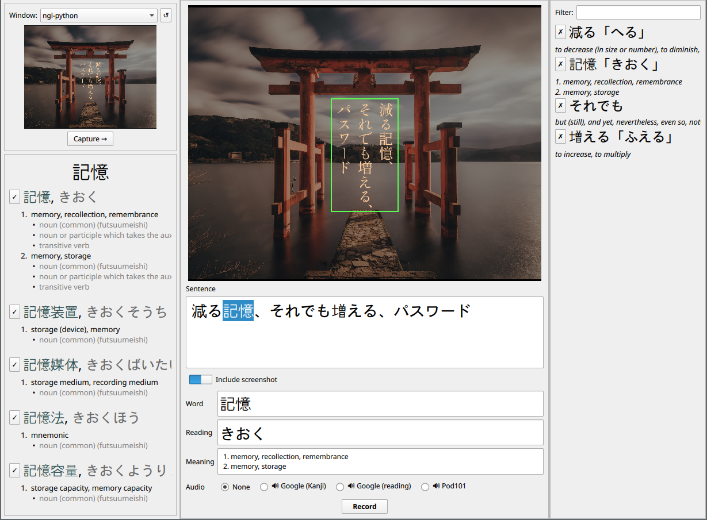

# SnapStudySensei

**SnapStudySensei** is a tool to assist with capturing, extracting, translating
and recording Japanese flashcards into [Anki].

This project is inspired by [Game2Text] but takes a different technical approach.




## Known limitations

- Currently **only supported on Linux**. Porting it to macOS and Windows should
  be doable by adding the ability to list windows (see `windows_list.py`, patch
  welcome)
- **No configuration**, only designed for my own needs so far
- A bit **slow to start** due to the OCR model initialization


## Installation

[Anki] and its [Anki-Connect] plugin must be installed.

```sh
python -m venv venv
. venv/bin/activate
pip install -e .
```

### Important note

This is a non-intrusive standalone installation, but system input methods (such
as fcitx) are unlikely to work due to how PySide6 isolation works inside a
virtual env. Installing it system wide is the only alternative I could find
so far.


## Running

[Anki] and its [Anki-Connect] plugin must be running.

Enter the venv (`. venv/bin/activate`) if you used that installation method, and
run `sss`.

### Important note

SnapStudySensei will automatically create a model, deck and flashcard templates
in Anki. The deck is called *SnapStudySensei* and is located in the *Japanese*
category.


## Thanks to

- [Manga OCR](https://github.com/kha-white/manga-ocr/)
- [JMdict](https://www.edrdg.org/wiki/index.php/JMdict-EDICT_Dictionary_Project)


[Anki]: https://apps.ankiweb.net
[Anki-Connect]: https://foosoft.net/projects/anki-connect
[Game2Text]: https://game2text.com