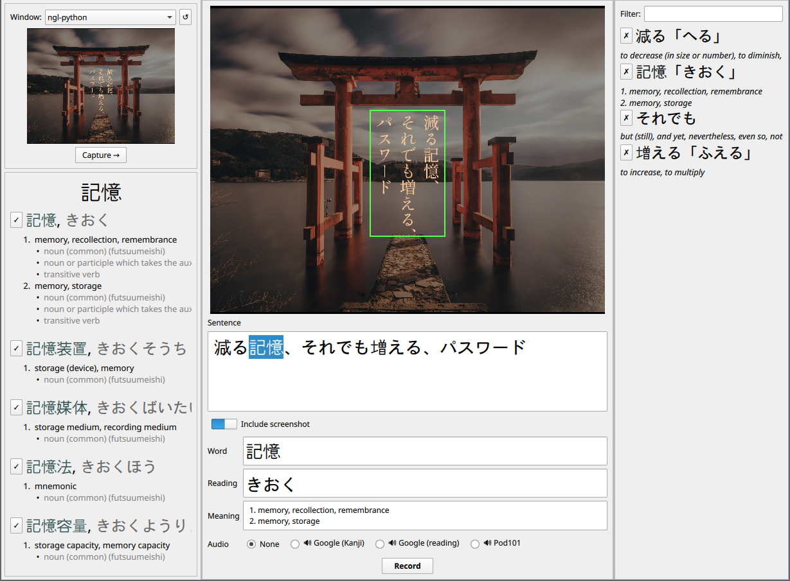

# SnapStudySensei

**SnapStudySensei** is a tool to assist with capturing and extracting Japanese
text, looking it up in a dictionary, and optionally recording flashcards into
[Anki].

This project is inspired by [Game2Text] but takes a different technical approach.




## Known limitations

- Currently **only supported on Linux**. Porting it to macOS and Windows should
  be doable by adding the ability to list windows (see `windows_list.py`, patch
  welcome)
- **No configuration**, only designed for my own needs so far
- A bit **slow to start** due to the OCR model initialization


## Installation

Install [Anki] and its [Anki-Connect] plugin if you want to record flashcards.
They are not required for the capture, OCR, dictionary, and text-to-speech
features.

```sh
python -m venv venv
. venv/bin/activate
pip install -e .
```

### Important note

This is a non-intrusive standalone installation, which means the Qt libraries
are duplicated within the virtual env. This breaks at least the fcitx input
method setup on the system. Setting `IBUS_USE_PORTAL=1 QT_IM_MODULE=ibus` in the
environment can be used as a [workaround] (ibus doesn't need to be installed).

[workaround]: https://github.com/fcitx/fcitx5/discussions/873#discussioncomment-7223614

## Running

To use the flashcard features, start [Anki] with its [Anki-Connect] plugin before
starting SnapStudySensei. If Anki-Connect is unavailable, SnapStudySensei starts
without the Records panel and card-recording controls.

Enter the venv (`. venv/bin/activate`) if you used that installation method, and
run `sss`.

### Important note

SnapStudySensei will automatically create a model, deck and flashcard templates
in Anki. The deck is called *SnapStudySensei* and is located in the *Japanese*
category.


## Thanks to

- [Manga OCR](https://github.com/kha-white/manga-ocr/)
- [JMdict](https://www.edrdg.org/wiki/index.php/JMdict-EDICT_Dictionary_Project)
- [Kokoro](https://huggingface.co/hexgrad/Kokoro-82M)


[Anki]: https://apps.ankiweb.net
[Anki-Connect]: https://foosoft.net/projects/anki-connect
[Game2Text]: https://game2text.com